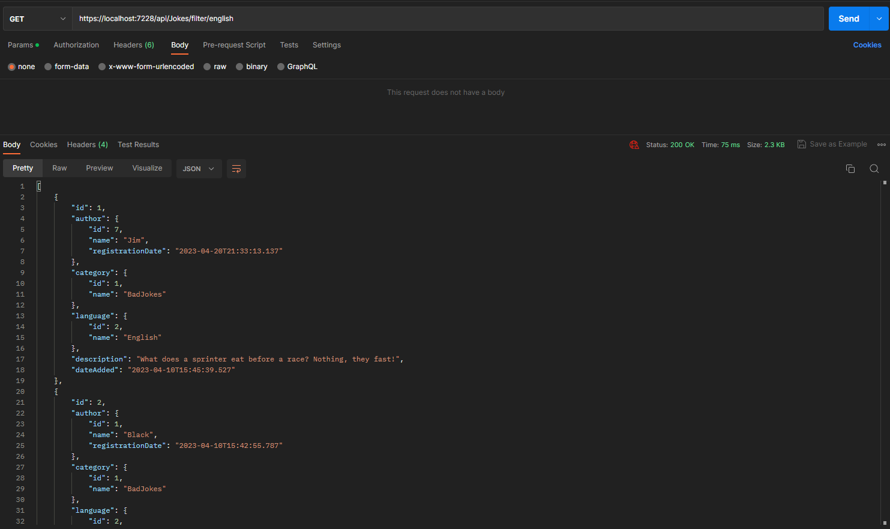
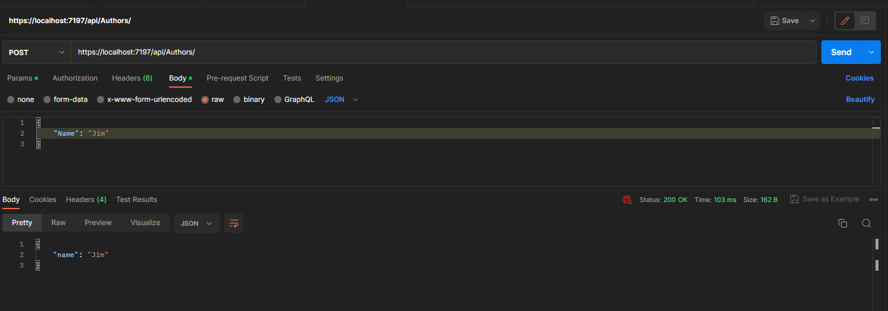
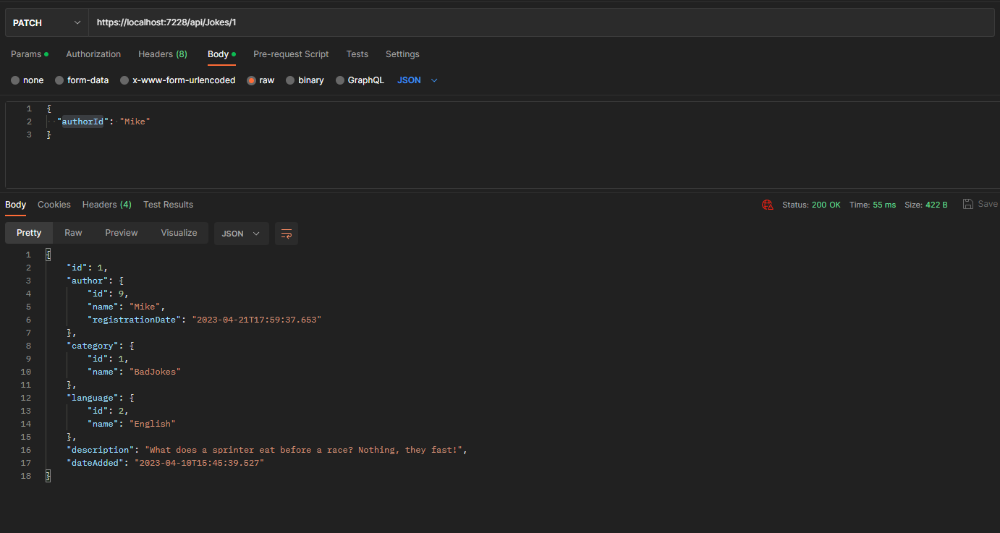

# JokesApi

Rest CRUD API for... Jokes! \
Using:
* .NET Core 6.0
* EF Core 7.0.4
* SQL Express 16.0.1
* AutoMapper 12.0.1

## Images:





## Prerequisites
* .NET 6
* SQL Express 16+ [*download here*](https://www.microsoft.com/en-us/sql-server/sql-server-downloads)
* SQL manager (ex: *SQL Server Management Studio*) (*Recommended*) [*download here*](https://learn.microsoft.com/en-us/sql/ssms/download-sql-server-management-studio-ssms?view=sql-server-ver16)


## Run the Project

1. Make sure you have a **SQL Express** instance running.
2. Use the **DBUtils/CreateJokesDb.sql** script in your favorite SQL manager to generate your database.
3. Add your connection string in **appsettings.json**:
```json
  "ConnectionStrings": {
    "DefaultConnectionString": "Server=(Your SQL Server); Initial Catalog = JokesDB; Integrated Security=True; Encrypt = False; ConnectRetryCount=0"
  }
```
4. Run the Project with:

```
dotnet run
```
## API Reference
***
### Get all:

```
  GET /api/${item}
```
Where **Item** can be:
* Categories
* Authors
* Jokes
* Languages

### Get a single item:

```
  GET /api/${item}/${id}
```
#### Ex:
```
  GET /api/authors/1
  GET /api/authors/Mike

```
| Parameter | Type         | Description                               |
| :-------- | :----------- | :---------------------------------------- |
| `item`    | `string`     | **Required**. Name of category            |
| `id`      | `int/string` | **Required**. Id or Name of item to fetch |

### Get jokes by filter:

```
  GET /api/jokes/filter/${languageId}/${categoryId}
```
#### Ex:
```
  GET /api/jokes/filter/english/christmas
```
| Parameter    | Type        | Description                                      |
| :----------- | :---------- | :----------------------------------------------- |
| `languageId` | `int/string`| **Required**. Id or Name of the desired language |
| `categoryId` | `int/string`| *Optional*. Id or Name of the desired category   |

### Create an item: 

```
  POST /api/${item}
```
#### Ex:
```
  POST /api/authors
```
#### Body Ex:
```json
{
    "Name" : "Jake"
}
```

| Parameter | Type     | Description                       |
| :-------- | :------- | :-------------------------------- |
| `item`    | `string` | **Required**. Name of item        |
| `body`    | `json`   | **Required**. Schema of item*     |

\* See [Schemas Section](#schemas) for more information.

### Delete an item:

```
  DELETE /api/${item}/${id}
```
#### Ex:
```
  DELETE /api/authors/15
```
| Parameter | Type     | Description                        |
| :-------- | :------- | :--------------------------------  |
| `item`    | `string` | **Required**. Name of item         |
| `id`      | `int`    | **Required**. Id of item to delete |

### Update an item:


```
  PUT /api/${item}/${id}
```
#### Ex:
```
  PUT /api/categories/12
```
#### Body Ex:
```json
{
    "Name" : "Bad Jokes"
}
```

| Parameter | Type      | Description                       |
| :-------- | :-------- | :-------------------------------- |
| `item`    | `string`  | **Required**. Name of item        |
| `id`      | `int`     | **Required**. Id of item          |
| `body`    | `json`    | **Required**. Schema of item*     |

\* See [Schemas Section](#schemas) for more information.

### Update partially a joke:


```
  PUT /api/jokes/${id}
```
#### Ex:
```
  PUT /api/jokes/14
```
#### Body Ex:
```json
{    
    "languageId" : "English "	    
    "description" : "This is your captain speaking. AND THIS IS YOUR CAPTAIN SHOUTING."	
}
```

| Parameter   | Type     | Description                       |
| :---------- | :------- | :-------------------------------- |
| `item`      | `string` | **Required**. Name of item        |
| `id`        | `int`    | **Required**. Id of item          |
| `body`      | `json`   | **Required**. Schema of item*     |

\* See [Schemas Section](#schemas) for more information.


### Schemas
***
#### Author/Category/Language:
#####  Create / Update
```
{
    "name"    :	  string      (not nullable)
}
```
#### Joke:
#####  Create / Update
```
{    
    "authorId"      :   string  (name or id)  (not nullable)
    "categoryId"    :   string  (name or id)  (not nullable)
    "languageId"	  :   string  (name or id)  (not nullable)
    "description"   :   string     	          (not nullable)
}
```

#####  Update partially
```
{    
    "authorId"        :   string  (name or id)   (nullable)
    "categoryId"	    :   string  (name or id)   (nullable)
    "languageId"	    :   string  (name or id)   (nullable)
    "description"	    :   string                 (nullable)
}
